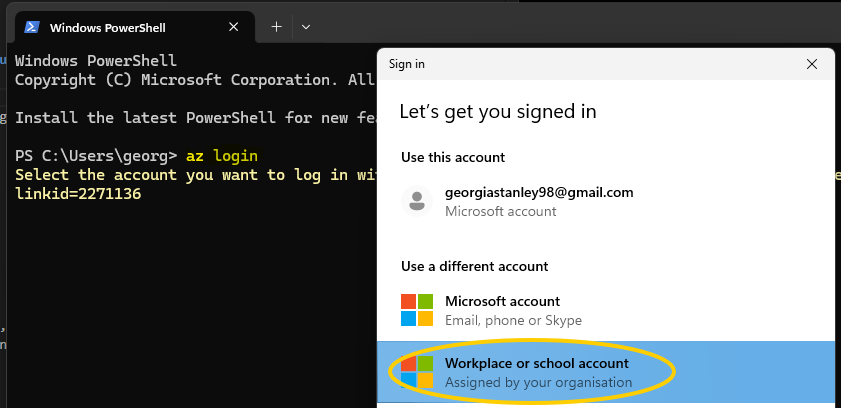
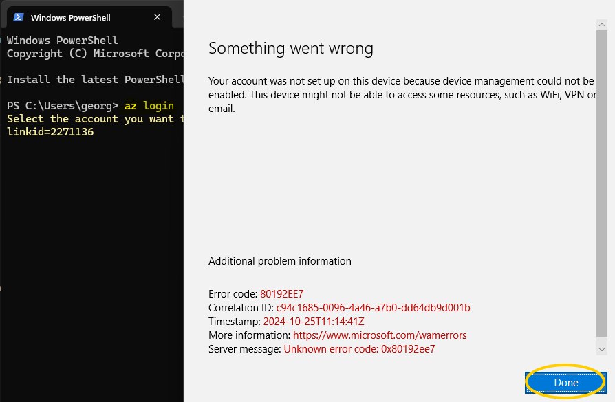
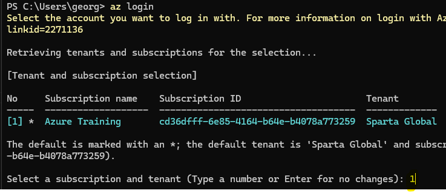

Table of Contents

- [Azure Documentation](#azure-documentation)
- [Task: Setup your repo to use Azure blob storage for state file management](#task-setup-your-repo-to-use-azure-blob-storage-for-state-file-management)
  - [Create new repo 'tech264-tf-azure'](#create-new-repo-tech264-tf-azure)
  - [Step 1: Create a Storage Account and Container in Azure](#step-1-create-a-storage-account-and-container-in-azure)
  - [Step 2: Configure Terraform Backend](#step-2-configure-terraform-backend)
  - [Step 3: Setup Main Architecture](#step-3-setup-main-architecture)
  - [Step 4: Verify and Share Links](#step-4-verify-and-share-links)
  - [Step 5: Documentation](#step-5-documentation)

<br>

# Azure Documentation
Source: https://learn.microsoft.com/en-us/cli/azure/group?view=azure-cli-latest#az_group_create

<br>

# Task: Setup your repo to use Azure blob storage for state file management
* Use a Terraform folder for the backend setup
* Use a Terraform separate folder for the main architecture (to deploy the app) which uses the backend setup for state file management

Deliverables:
* In the one Teams message in the main chat, paste links:
  * to your app running which was deployed by Terraform using remote state file management on Azure.
  * a link to where your state files are stored in blob storage on the Azure portal (NOT the URL to the state files as they should NEVER be made public).
* Link to your documentation pasted into the main chat around COB.

<br>

## Create new repo 'tech264-tf-azure'
* Go to GitHub > create new repo 'tech264-tf-azure'.
* Go to GitHub Repo > `mkdir tech264-tf-azure`
* cd into new repo.
* `git init`
* `git add .`
* `git commit -m "xxxx"`
* `git branch -M main`
* `git remote add origin` https://github.com/GP-Stanley/tech264-tf-azure.git
* `git push -u origin main`

<br>

## Step 1: Create a Storage Account and Container in Azure
1. Login to Azure.
   * I'm using the Windows Powershell terminal. 
   * If you don’t have the Azure CLI, install it and login by running: `az login`. 



* Even though "Something went wrong", click "Done"



* Select your subscription with "1"



<br>

1. Create a Resource Group:  
   * This is like a folder that holds all the Azure resources you’ll create.
   * I'm still using the Windows Powershell terminal.
   * Code example: `az group create -l westus -n MyResourceGroup`

```bash
az group create -l uksouth -n tech264
```


<br>

1. Create a Storage Account.


<br>

3. Create a Blob Container.

## Step 2: Configure Terraform Backend
1. Create a backend.tf file in a separate folder (e.g., terraform-backend).
2. Initialise the Backend.

## Step 3: Setup Main Architecture
1. Create a new folder for your main architecture (e.g., terraform-main).
2. Create your Terraform configuration files (e.g., main.tf, variables.tf, etc.) in this folder.
3. Reference the Backend Configuration.
4. Initialise and Apply.

## Step 4: Verify and Share Links
1. Verify your app is running and accessible.
2. Get the link to your state files in the Azure portal.
3. Share the Links.

## Step 5: Documentation
* Document your process and any configurations.
* Share the documentation link in the main chat by COB.

<br>