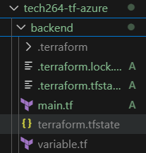
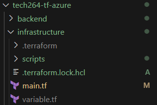
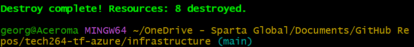
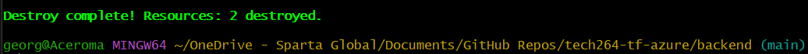

Table of Contents

- [Azure Documentation](#azure-documentation)
- [Task: Setup your repo to use Azure blob storage for state file management](#task-setup-your-repo-to-use-azure-blob-storage-for-state-file-management)
  - [What's the Point? What's the Benefit?](#whats-the-point-whats-the-benefit)
- [Directory Structure](#directory-structure)
- [Setting Up a Terraform Project with Backend and Infrastructure Separation](#setting-up-a-terraform-project-with-backend-and-infrastructure-separation)
  - [Step 1 (optional): Create new repo 'tech264-tf-azure'](#step-1-optional-create-new-repo-tech264-tf-azure)
  - [Step 2: Configure Terraform Backend](#step-2-configure-terraform-backend)
  - [Step 3: Setup Main Architecture to Use Backend](#step-3-setup-main-architecture-to-use-backend)
    - [What's going on here?](#whats-going-on-here)
  - [Summary](#summary)
    - [Backend Folder](#backend-folder)
    - [Infrastructure Folder](#infrastructure-folder)
    - [Separation of Concerns](#separation-of-concerns)
- [Deleting the VMs we've Created](#deleting-the-vms-weve-created)

<br>

# Azure Documentation
Source: https://learn.microsoft.com/en-us/cli/azure/group?view=azure-cli-latest#az_group_create

<br>

# Task: Setup your repo to use Azure blob storage for state file management
* Use a Terraform folder for the backend setup
* Use a Terraform separate folder for the main architecture (to deploy the app) which uses the backend setup for state file management

Deliverables:
* In the one Teams message in the main chat, paste links:
  * to your app running which was deployed by Terraform using remote state file management on Azure.
  * a link to where your state files are stored in blob storage on the Azure portal (NOT the URL to the state files as they should NEVER be made public).
* Link to your documentation pasted into the main chat around COB.

<br>

## What's the Point? What's the Benefit?
Separating the backend configuration from the main infrastructure deployment in a Terraform project has several key benefits:

* **State Management**: The backend configuration handles where Terraform stores its state files. 
  * By separating this, you can use remote backends like AWS S3, Azure Blob Storage, or Terraform Cloud, which allow for better collaboration and state locking to prevent conflicts.

* **Security**: Storing state files remotely can enhance security by keeping sensitive information off local machines. 
  * Remote backends often support encryption and access controls1.

* **Scalability**: Separating backend and infrastructure allows you to manage and scale your infrastructure more efficiently. 
  * You can update backend configurations without affecting the main infrastructure code2.

* **Modularity**: This separation promotes a modular approach to infrastructure as code (IaC). 
  * You can reuse backend configurations across different projects or environments, making your setup more maintainable and consistent2.

* **Collaboration**: Teams can work on different parts of the infrastructure simultaneously without stepping on each other’s toes. 
  * The backend ensures that everyone is working with the most up-to-date state1.

<br>

# Directory Structure
```bash
/terraform-project
  ├── /backend
  │    └── main.tf (contains backend configuration)
  └── /infrastructure
       ├── main.tf (contains main architecture for deploying the app)
       └── variables.tf (optional, contains input variables)
```

<br>

# Setting Up a Terraform Project with Backend and Infrastructure Separation
How to create a Terraform project that separates the backend configuration (for state management) from the main infrastructure deployment.

<br>

## Step 1 (optional): Create new repo 'tech264-tf-azure'
* Go to GitHub > create new repo 'tech264-tf-azure'.
* Go to GitHub Repo > `mkdir tech264-tf-azure`
* cd into new repo.
* `git init`
* `git add .`
* `git commit -m "xxxx"`
* `git branch -M main`
* `git remote add origin` https://github.com/GP-Stanley/tech264-tf-azure.git
* `git push -u origin main`

<br>

## Step 2: Configure Terraform Backend
1. Create a backend folder within the tech264-tf-azure repo (e.g., backend).
2. Inside the backend folder, create a file named main.tf. 
   * This file will define the Azure storage account where Terraform will store its state file. 
   * The backend folder can have a variable.tf file. 
3. Define the Provider: In main.tf, specify the Azure provider and configure it to use the Azure CLI for authentication

```bash
provider "azurerm" {
  features {}
  use_cli = true
  subscription_id = var.subscription_id
  resource_provider_registrations = "none"
}
```
4. Reference an Existing Resource Group:
   * Use a data block to reference an existing Azure resource group. Replace "tech264" with the actual name of your resource group.

```bash
data "azurerm_resource_group" "main" {
  name = "tech264"
}
```

5. Create a Storage Account.
   * Define a storage account resource. The name must be unique across Azure.

```bash
resource "azurerm_storage_account" "backend_sa" {
  name                     = "tfpriyanstorageacct"
  resource_group_name      = data.azurerm_resource_group.main.name
  location                 = data.azurerm_resource_group.main.location
  account_tier             = "Standard"
  account_replication_type = "LRS"
  allow_nested_items_to_be_public = false
  tags = {
    Name = "priyan"
  }
}
```

6. Create a Storage Container.
   * Define a storage container within the storage account to hold the Terraform state file.

```bash
resource "azurerm_storage_container" "tfstate" {
  name                  = "tfstate"
  storage_account_name  = azurerm_storage_account.backend_sa.name
  container_access_type = "private"
}
```

<br>

7. Initialise the Backend folder via GitHub terminal to deploy backend.
   * cd into the backend folder via Git Bash window. 
   * Use the `terraform init` command to initialise the working directory. This will download the necessary provider plugins, set up the backend and prepare the environment for further commands. 
   * Use the `terraform apply` to create the Azure Storage Account and container for storing the state files.

8. After applying, take note of the following values:
   * **Storage Account Name**: azurerm_storage_account.backend_sa.name
   * **Container Name**: azurerm_storage_container.tfstate.name



<br>

## Step 3: Setup Main Architecture to Use Backend
1. Create a new folder for your main architecture (e.g., called infrastructure).
2. Create your Terraform configuration files (e.g., main.tf, variables.tf, etc.) in the "infrastructure" folder.
   * Include your existing deployment script here. At the top of main.tf, you’ll add a section to reference the backend.
3. Reference the Backend Configuration.
   * In main.tf, add a block to tell Terraform to use Azure Blob Storage for storing state files. This ensures that your state files are stored remotely and securely.
```bash
# Use Azure blob storage as backend for terraform state files. 
terraform {
  backend "azurerm" {
    resource_group_name = "tech264"
    storage_account_name = "tfgeorgiastorageaccount"
    container_name = "tfstate"
    key = "terraform.tfstate" # You can organise state files by folder
  }
}
```
4. Initialise and Apply.
   * cd into "infrastructure" file and `terraform init` to initialise the folder. 
   * After initialisation, run terraform apply to create or update your infrastructure based on the configuration files.

5. Replace.
   * Make sure to replace the resource_group_name, storage_account_name, container_name, and key with the actual names created in the backend.



<br>

### What's going on here?
* **Folder Setup**: You’re organising your project by separating the backend configuration from the main infrastructure setup.
* **Backend Reference**: By referencing the backend in main.tf, you’re telling Terraform where to store its state files (in Azure Blob Storage).
* **Provider Configuration**: You’re setting up the Azure provider to manage your resources in Azure.
* **Initialisation**: terraform init prepares your working directory for use with Terraform.
* **Application**: terraform apply executes the plan to create or update your infrastructure.

This process ensures that your Terraform state files are securely stored and your infrastructure is managed efficiently. 

<br>

## Summary
### Backend Folder
* **Purpose**: This folder contains the configuration needed to set up Azure Blob Storage for storing the Terraform state file.
* **Contents**: Typically includes files like main.tf and variables.tf that define the storage account and container for the state file.
* **Functionality**: Ensures that the state file is stored remotely, enhancing security and enabling better collaboration among team members.

### Infrastructure Folder
* **Purpose**: This folder contains the main infrastructure deployment configuration.
* **Contents**: Includes files like main.tf, variables.tf, and other Terraform configuration files that define the resources to be deployed.
* **Functionality**: Uses the backend configuration to manage the state file, ensuring that the infrastructure state is tracked and stored securely.

### Separation of Concerns
* **Organisation**: By separating the backend configuration from the main infrastructure deployment, you can manage each aspect independently. This improves the organisation of your Terraform project.
* **Maintainability**: This setup makes it easier to update and maintain your infrastructure. Changes to the backend configuration do not affect the main infrastructure code and vice versa.
* **Modularity**: Promotes a modular approach to infrastructure as code (IaC), allowing you to reuse backend configurations across different projects or environments.
* **Scalability**: Facilitates scaling your infrastructure efficiently by managing backend and infrastructure separately.
* **Collaboration**: Enables multiple team members to work on different parts of the infrastructure simultaneously without conflicts, as the backend ensures everyone is working with the most up-to-date state.

This structured approach ensures that your Terraform project is well-organised, secure, and easy to manage, making it a robust solution for infrastructure deployment and state management. 

<br>

# Deleting the VMs we've Created
1. Go to the Azure portal and start your VMs that you want to delete.
   * e.g., tech264-georgia-tf-app-vm, and tech264-georgia-tf-db-vm. 
2. `terraform destroy` infrastructure file first. 
   * cd into 'tech264-tf-azure' > 'infrastructure'.
   * command `terraform destroy` > give permission ('yes').



3. `terraform destroy` backend file next. 
   * cd into 'tech264-tf-azure' > 'backend'.
   * command `terraform destroy` > give permission ('yes').



<br>